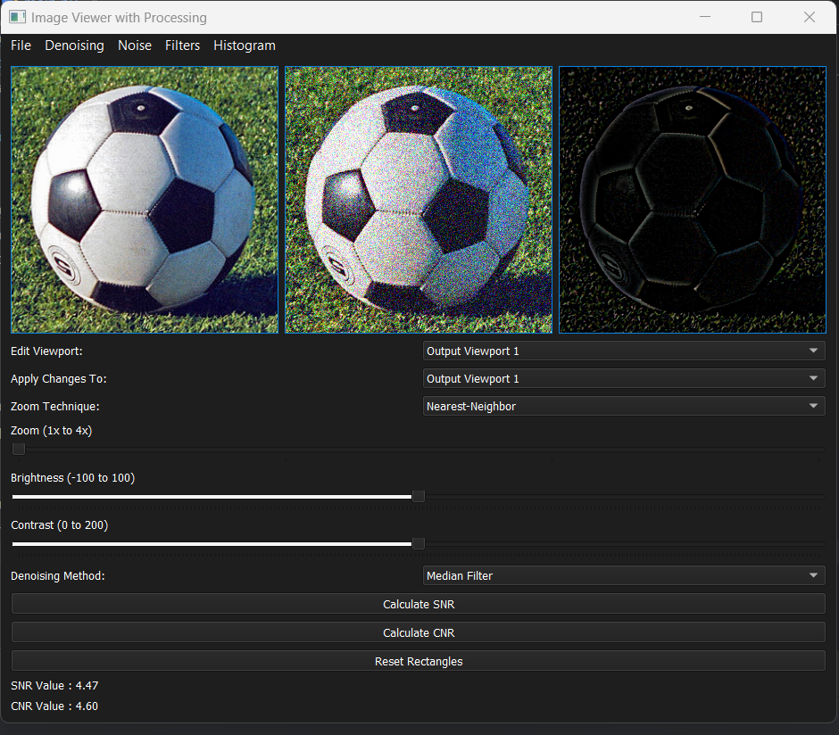
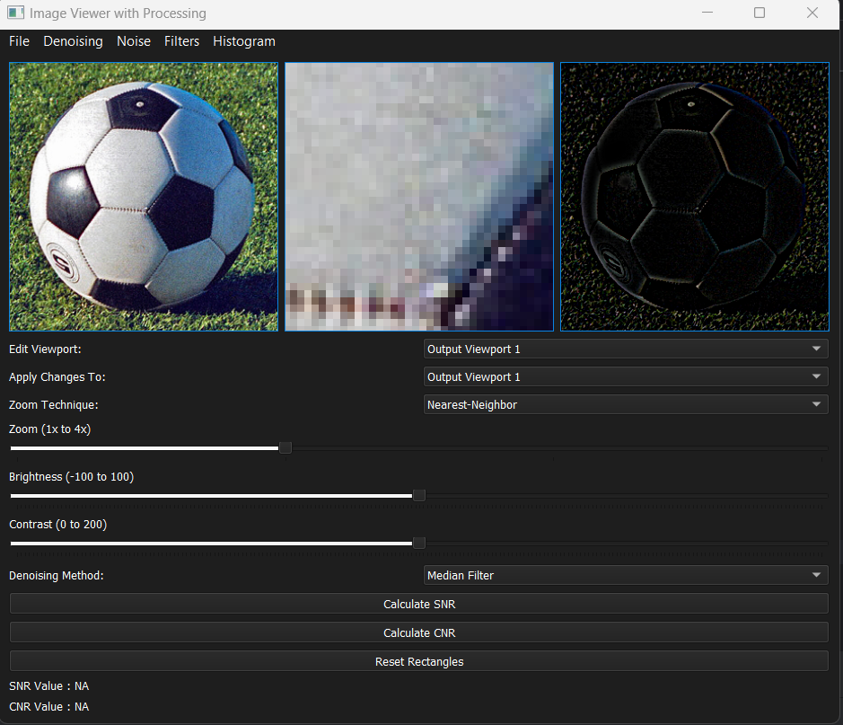
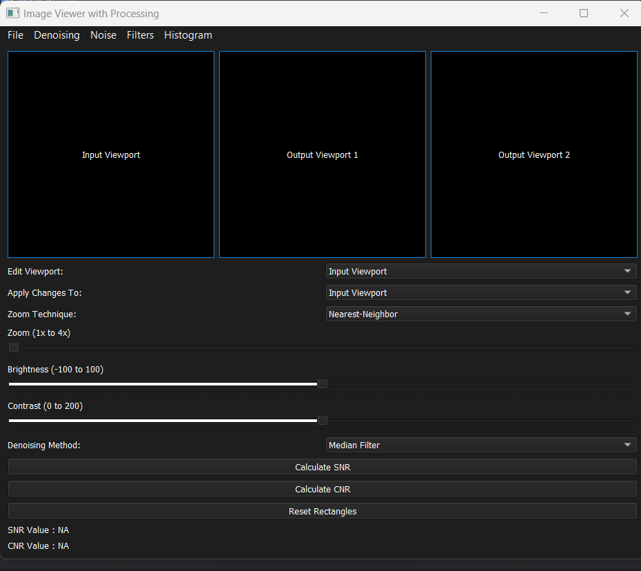

<p align="center">
  <a href="" rel="noopener">
    


</p>
<p align="center">
    <br> 
</p>
<div align="center">

[](https://github.com/hamdy-cufe-eng/Dicom-Viewer/contributors)
[](https://github.com/hamdy-cufe-eng/Dicom-Viewer/issues)
[](https://github.com/hamdy-cufe-eng/Dicom-Viewer/network)
[](https://github.com/hamdy-cufe-eng/Dicom-Viewer/stargazers)
[](https://github.com/hamdy-cufe-eng/Dicom-Viewer/blob/main/LICENSE)

</div>

<details>
  <summary>Table of Contents</summary>
  <ol>
    <li>
      <a href="#about">About The Project</a>
      <ul>
        <li><a href="#tech">Built Using</a></li>
      </ul>
    </li>
    <li>
      <a href="#install">Getting Started</a>
      <ul>
        <li><a href="#install">Installation</a></li>
      </ul>
    </li>
    <li><a href="#start">How to start</a></li>
    <li><a href="#features">Features</a></li>
    <li><a href="#screenshots">Screenshots</a></li>
	<li><a href="#contributors">Contributors</a></li>
  </ol>
</details>


## About

 Advanced Dicom Viewer with multiple features, 
 Simplified interface for viewing/displaying data .

## 💻 Built Using <a name = "tech"></a>
* 
* 
* 
- [pydicom](https://pydicom.github.io/)
- [PyQt5]()


## 🏁 Get Started /Installation <a name = "install"></a>
1. **Clone the repository**
```
git clone https://github.com/hamdy-cufe-eng/Dicom-Viewer.git
```
2. **Install Visual Studio Code || PyCharm**


3. **Open the folder in IDE**

4. **install dependencies**
```
pip install 
```

5. **Build the project**


6. **You can run through**


## 📌 How to use <a name = "start"></a>

### Usage :
- After compiling the project , try to load the desired file (M2D ,2D,3D) using the **Open DICOM File** button
- Click **View All DICOM Tags** to view all tags 
- You can use search for a specifec keyword in the tags 

## 🎆 Features <a name = "features"></a>

- Loading multi-files ~> M2d , 3D, 2d
- Viewing 3d as tiles / video
- Viewing M2d as video playback (ability to auto-startover) and 2D as Image
- Viewing Patient info by group tags , Meta ,Equipment,Image ,etc by adding keywords to array
- Ability to search for a specifec keyword
- Anonomyzing the values of selected keywords by appending a constant prefix
- Filtering unnecessary keywords
- Displaying the current status on a customized textbox
- Modern Flat-UI 

## 📷 Screenshots <a name = "screenshots" ></a>

<div name="Screenshots" align="center">
   
   <hr>
    
    <hr>
  
   
   <hr>
  
   
   <hr>
</div>

## Contributors <a name = "contributors"></a>
<table align="center">
  <tr>
    <td align="center">
    <a href="https://github.com/hamdy-cufe-eng" target="_black">
    
    <br />
    <sub><b>Hamdy Ahmed</b></sub></a>
    </td>
    <td align="center">
    <a href="https://github.com/Karim-Mohamed-Elsayed" target="_black">
    
    <br />
    <sub><b>Karim Mohamed</b></sub></a>
    </td>
     <td align="center">
    <a href="https://github.com/David-Amir-18" target="_black">
    
    <br />
    <sub><b>David Amir</b></sub></a>
    </td>
    
  </tr>
 </table>
